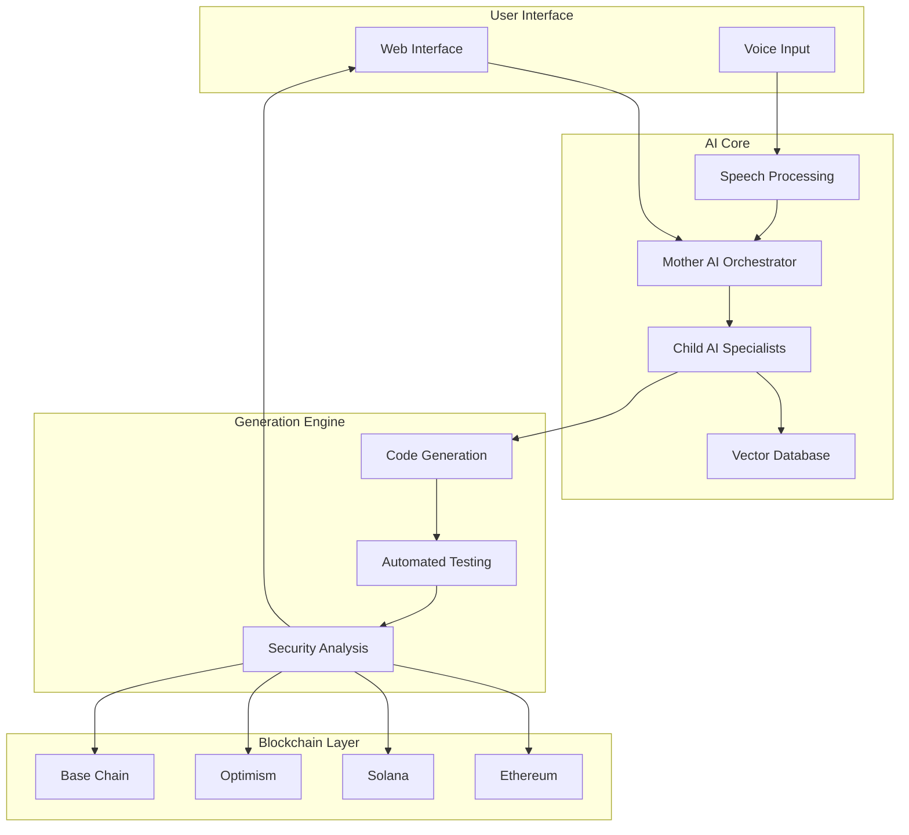

# GAIN-CHAIN-AI---ABOUT-US

# 🔗 Gain Chain AI (GAIN CHAIN AI)

  
  <h3>Voice-Activated AI for Blockchain Development</h3>
  
Transforming natural language into functional blockchain applications

## 📋 Contents

- [Overview](#-overview)
- [Key Features](#-key-features)
- [Project Status](#-project-status)
- [Technology Stack](#-technology-stack)
- [Architecture](#-architecture)
- [Getting Started](#-getting-started)
- [Usage Examples](#-usage-examples)
- [Roadmap](#-roadmap)
- [Contributing](#-contributing)
- [License](#-license)
- [Contact & Community](#-contact--community)
- [FAQ](#-faq)

## 🌟 Overview

**GAIN CHAIN AI (Gain Chain AI)** is a revolutionary platform that democratizes blockchain development through an intuitive, AI-powered interface. By enabling users to create decentralized applications (dApps) and smart contracts using plain English prompts or voice commands, GAIN CHAIN AI eliminates the technical barriers that have traditionally limited blockchain adoption.

Our platform supports multiple blockchain protocols and features a user-friendly interface, making it accessible to both experienced developers and complete beginners. Transform your blockchain ideas into reality without writing a single line of code.

> 💡 **Our Mission**: To make blockchain development accessible to everyone, regardless of technical background, and accelerate the adoption of Web3 technologies.

## ✨ Key Features

### 💬 Natural Language to Code Generation
Convert plain English descriptions into functional blockchain code. Simply describe what you want to build, and GAIN CHAIN AI generates the necessary smart contracts and dApp code.

### 🗣️ Voice-Activated Development
Build while you speak with our advanced dual-tier speech processing system. Experience a hands-free coding environment with natural conversation flow.

### 🧠 AI-Powered Development
Our innovative "Mother-Child" AI architecture optimizes prompts and generates secure, production-ready code with contextual awareness.

### 🔗 Multi-Protocol Support
Deploy to multiple blockchains including Ethereum, Solana, Base Chain, and Optimism with a unified development experience across different protocols.

### ⚡ Accelerated Development
Reduce development time from weeks to hours. Go from concept to deployment in a single session instead of months of development.

### 🛡️ Security-First Approach
Generate secure smart contracts with automated vulnerability scanning and adherence to blockchain security best practices.

## 🚦 Project Status

GAIN CHAIN AI is currently in **early development** with focus on MVP features. We're working toward our first public beta and actively seeking contributors.

- ✅ Concept validation completed
- ✅ Architecture design finalized
- 🔄 Core AI model development in progress
- 🔄 MVP development underway
- 📅 Private beta planned for Q3 2024
- 📅 Public beta launch scheduled for Q4 2024

Join our [waitlist](https://gainchainai.pro) to get early access and updates!

## 💻 Technology Stack

### Frontend
- **React** with TypeScript
- **Redux** for state management
- **Monaco Editor** for code editing
- **Tailwind CSS** for styling
- **React Three Fiber** for 3D visualizations
- **Framer Motion** for animations

### Backend
- **Node.js** with Express
- **MongoDB** for data storage
- **PostgreSQL** for relational data
- **JWT** authentication
- **RESTful API** architecture

### AI/ML
- Multiple specialized AI models for different blockchain protocols
- Vector database for semantic memory
- Speech processing pipeline (dual-tier architecture)
- Prompt optimization system

### Blockchain Integration
- **Ethereum**: Web3.js, Ethers.js
- **Solana**: @solana/web3.js
- **Optimism/Base**: Optimism SDK
- **Smart Contract Deployment** infrastructure

## 🏗️ Architecture

GAIN CHAIN AI features a sophisticated architecture designed for flexibility, security, and performance:

Our unique "Mother-Child" AI architecture uses a central orchestration model to route specialized development tasks to purpose-built AI models for each blockchain protocol, ensuring optimal code generation for every use case.

## 📈 Roadmap

GAIN CHAIN AI development is planned in several phases:

### Phase 1: Foundation (Completed)
- Project setup & planning
- Development environment configuration
- Core architecture design

### Phase 2: MVP Development (In Progress)
- Frontend dashboard development
- Core AI model integration
- Basic blockchain support (Ethereum, Solana)
- User authentication system

### Phase 3: Platform Enhancement (Upcoming)
- Voice command system implementation
- Template marketplace development
- Expanded blockchain support
- Collaboration features

### Phase 4: Enterprise & Growth (Future)
- Team management features
- Advanced security features
- Mobile application
- Analytics dashboard

### Phase 5: Ecosystem Expansion (Future)
- Additional blockchain support
- Plugin system
- Public API
- SDK development

## 👩‍💻 Contributing

We welcome contributions from the community! Please read our [Contributing Guidelines](CONTRIBUTING.md) for more information on how to get started.

### How You Can Help
- 🐛 Bug reporting and fixes
- ✨ Feature implementation
- 📝 Documentation improvements
- 🧪 Writing tests
- 💡 Providing feedback and ideas

## 📄 License

GAIN CHAIN AI is released under the [MIT License](LICENSE).

## 📱 Contact & Community

- **Website**: [https://gchain.ai](https://gainchainai.pro)
- **Twitter**: [@GainChainAI](https://twitter.com/GainChainAI)
- **Discord**: [Join our community](https://discord.gg/gchain)
- **Email**: gainchainai.dev@gmail.com

## ❓ FAQ

### What is GAIN CHAIN AI?
GAIN CHAIN AI is a revolutionary platform that enables anyone to create blockchain applications using natural language prompts or voice commands, without requiring coding knowledge.

### How does voice-activated development work?
GAIN CHAIN AI employs a dual-tier speech processing system that converts your voice commands into structured instructions. These instructions are then processed by our specialized AI models to generate functional blockchain code.

### Which blockchains are supported?
The initial MVP will support Ethereum and Solana, with plans to expand to Optimism, Base Chain, and other protocols in future releases.

### Do I need technical knowledge to use GAIN CHAIN AI?
No! GAIN CHAIN AI is designed to be accessible to both technical and non-technical users. You only need to describe what you want to build in plain English.

### How secure are the generated smart contracts?
GAIN CHAIN AI implements multiple layers of security checks, including automated vulnerability scanning, static analysis, and adherence to established security patterns for each blockchain.

### When will GAIN CHAIN AI be available?
We're currently developing our MVP with plans for a private beta in Q3 2024 and public beta in Q4 2024. Join our waitlist to get early access!

---

  
Built with ❤️ by the GAIN CHAIN AI team

 
